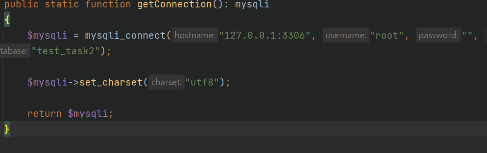
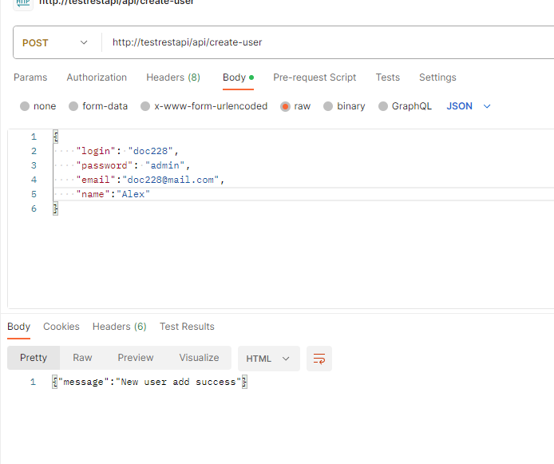
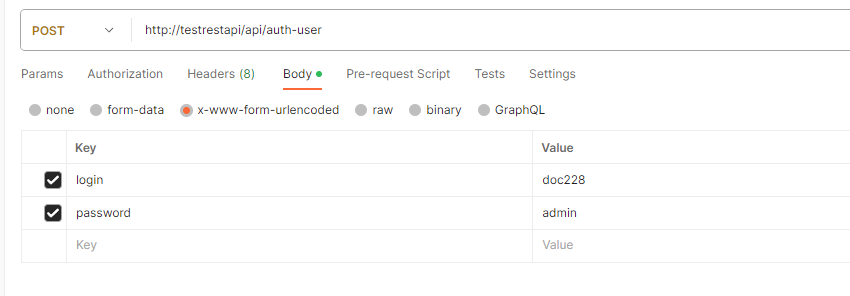
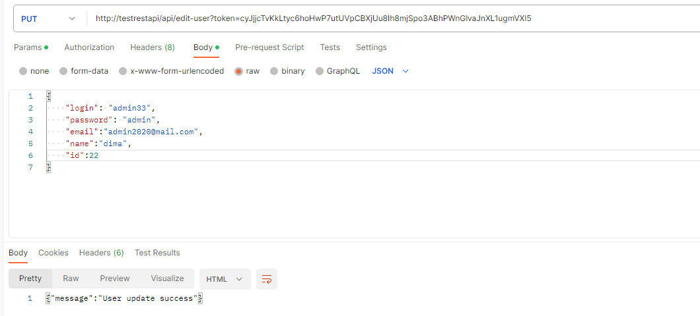
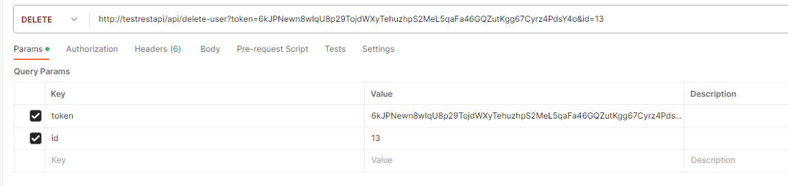
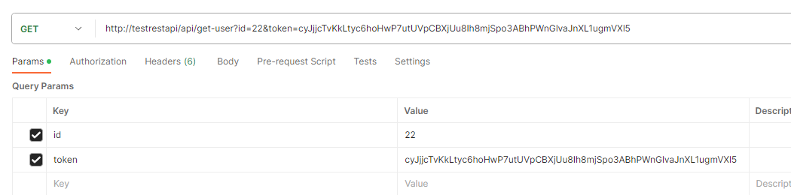

Настроить подключение db\DbConnector

взять из дампа таблицу users 
users.sql

запросы для добавления ползователя запрос: 
Url: http://testrestapi/api/create-user
Body( принимает raw,form-data,x-www-form-urlencoded):
{
"login": "doc228",
"password": "admin",
"email":"doc228@mail.com",
"name":"Alex"
}

для авторизации:
URL: http://testrestapi/api/auth-user
Body(принимает raw,form-data,x-www-form-urlencoded):
{
"login": "doc228",
"password": "admin"
}

для обновления данных о пользователе:
URL: http://testrestapi/api/edit-user?token=cyJjjcTvKkLtyc6hoHwP7utUVpCBXjUu8Ih8mjSpo3ABhPWnGlvaJnXL1ugmVXl5
Body(принимает raw,x-www-form-urlencoded):
{
"login": "admin33",
"password": "admin",
"email":"admin2020@mail.com",
"name":"dima",
"id":22
}

для удаления пользователя:
URL: http://testrestapi/api/delete-user?token=6kJPNewn8wIqU8p29TojdWXyTehuzhpS2MeL5qaFa46GQZutKgg67Cyrz4PdsY4o&id=13

для получения информации о пользователе:
URL: http://testrestapi/api/get-user?id=22&token=cyJjjcTvKkLtyc6hoHwP7utUVpCBXjUu8Ih8mjSpo3ABhPWnGlvaJnXL1ugmVXl5

